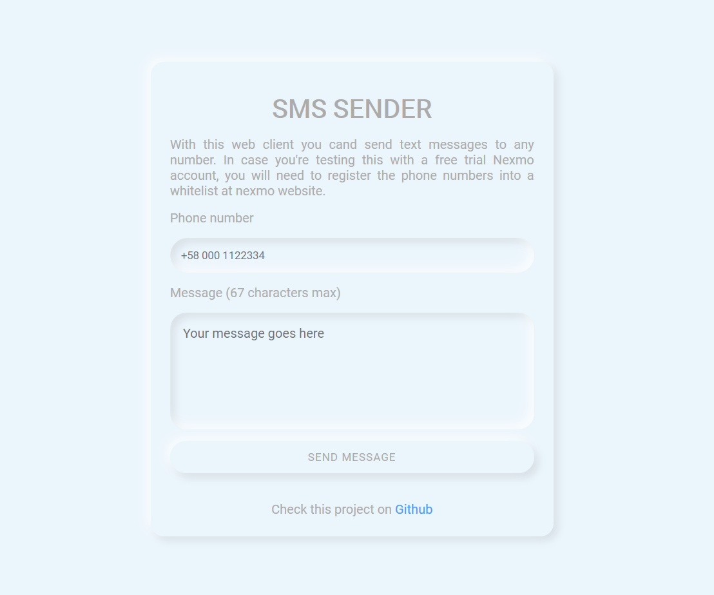

# SMS Sender
A small express app to send SMS using Nexmo SMS API. Nexmo is a service for communication, that offers a 2$ credit on Free Trial to test their APIs.

## How to run it (You need npm)
Put your NEXMO_KEY and NEXMO_SECRET on .env file like its shown in .env.example file

Install dependencies
`npm i`

Run the server
`npm start`

## How to test it
There´s an small client for sending messages at root route just open the browser and go to http://localhost:PORT/

